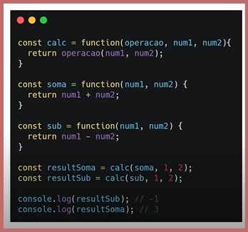

# Estrutura função anônima.

## Ojetivos

1: Apresentar a estrutura de uma função.

2: Alguns outros tipos de funções e como são utilizada.

### Estrutura.

* Definição como de uma função: Variáveis criadas dentro de uma função apenas podem ser utilizadas dentro dela.

## Função Anônima:
* funções que representam expressôes
- Uma variável pode armazenar uma função.

## Funções Função autoinvocável e Callbacks

### Função autoinvocável.
* IIFE (Immediately Invoked Function Expression)

* Também pode ser utilizada com parâmetros ou armazenada em uma variável.

.

## Callbacks;

* Uma função passada como argumento para uotra.
* Utilizada Callbacks, você tem maior controle da ordem de chamadas.

*****

## Funções Valores padrão e Objeto "arguments"

### Objetivo:
1: Ensinar como manipular parâmetros de uma função.

2: Técnicas para loidar com números indefinidos de parâmetros.

### Valores padrão
* tem seu valor padrão como undefined . Isso significa que se você não passar os argumentos ao chamar uma função, seus parâmetros terão undefined como seus valores padrão.

### Funções Objeto arguments.

* Uma array com todas os parâmettros passados quando a função foi invocada.

.

* Sengundo exemplo.

