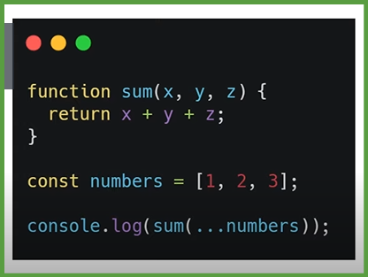
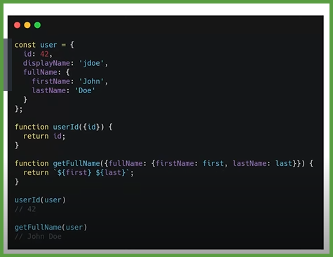
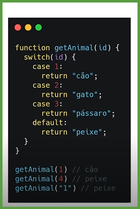

# Estrutura função anônima.

## Ojetivos

1: Apresentar a estrutura de uma função.

2: Alguns outros tipos de funções e como são utilizada.

### Estrutura.

* Definição como de uma função: Variáveis criadas dentro de uma função apenas podem ser utilizadas dentro dela.

## Função Anônima:
* funções que representam expressôes
- Uma variável pode armazenar uma função.

## Funções Função autoinvocável e Callbacks

### Função autoinvocável.
* IIFE (Immediately Invoked Function Expression)

* Também pode ser utilizada com parâmetros ou armazenada em uma variável.

.

## Callbacks;

* Uma função passada como argumento para uotra.
* Utilizada Callbacks, você tem maior controle da ordem de chamadas.

*****

## Funções Valores padrão e Objeto "arguments"

### Objetivo:
1: Ensinar como manipular parâmetros de uma função.

2: Técnicas para loidar com números indefinidos de parâmetros.

### Valores padrão
* tem seu valor padrão como undefined . Isso significa que se você não passar os argumentos ao chamar uma função, seus parâmetros terão undefined como seus valores padrão.

### Funções Objeto arguments.

* Uma array com todas os parâmettros passados quando a função foi invocada.

.

* Sengundo exemplo.

****

## Funções Arrays e Objetos.

### Arrays.

* **Spread:** Uma forma de lidar separadamente com elementos.

O que era de um array se torna um elemento independente.

* **Rest:** Combina os argumento en array

O que era um elemento indenpentiente se torma parte de um array.

### Objetos.
* Objeto Destructuring. Entre chaves{}, podemos filtrar apenas os dados que nos interessan en um objeto.

.

## Funções If/else e 

### Objetivo

1: Ensinar como utilizar algumas das mais famosas declarações do javascript.

* Funções If/else

* 1: Outro exemplo If else 

* 2: Outro exemplo If else

****
### switch
* Equivale a uma comparação de tipo s valor (===).
* Sempre precisa de um valor "default".
* Ideal para quando se precisa comparar muitos valores.

.

****

## Funções For e While, Do While.

### FOR:
* Loop dentro de elementos iteráveis (arrays, strings). 

### Outra variações for in.
* LOOP entre propiedades enumeráveis de um objeto.

.

### Outra variações for of.
* LOOP entre estruturas iteráveis (arrays, strings).

.

### While.
* Executa instruções até que a condição se torne falsa.

.

### Do While
* Executa instruções até que a condição se torne falsa.
* Porém **a primeira execução sempre ocurre.**

***

## Funções O que é This
* A palavra reservada THIS é uma referência de contexto.
* No exemplo, THIS refere-se ao objeto pessoa.

.

* Seu valor pode mudar de acordo com o lugar np código onde foi chamado.

.

* 1 exemplo:

* 2 exemplo em um evento no HTML:

****

## Funções Manipulando seu valor

### Metodo Call.
* É possivel passar parámetros para essa função separando-os por virgulas.

----

-----

### Função Apply.

----

* Diferencia de Apply é possivel passar parâmetros para essa função dentro de um array.

### Outro metodo é Bind.
* Clona a estrutura da funççao onde é chamada e aplica o valor do objeto passado como parâmetro.

